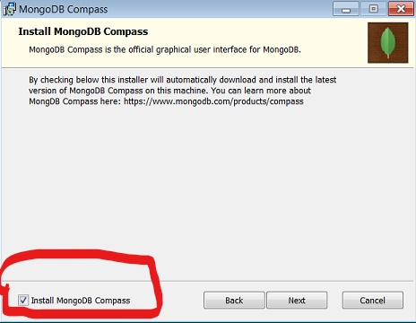

## How to Install

1. Follow the <a href="https://www.mongodb.com/try/download/enterprise">MongoDB  link</a>
2. choose your OS
3. Select the latest version
4. Click 'Download'
5. Follow the steps in the set up wizard 
    - make sure "Install MongoDB Compass" is checked


## MongoDB Shell

##### Install 
```bash
$ sudo apt install mongodb
```

##### Launch Mongo Shell
Using the default host and port
- {host} => custom host
- {port} => custom port
```bash
$ mongo 
```

Using a custom host and port
```bash
$ mongo {host}:{port} 
```

Connect Remote:
- {username} => your mongoDB username
- {server} => your mongoDB cluster
```bash
$ mongo "mongodb+srv://{server}/{dbname}" --username {username}
```

##### Finding and Selecting Databases and Collections
Show all databases
```bash
> show dbs
```

select a database
- {database} => database you want to use
```bash
> use {database}
```

##### Basic Operations
- {collection} => the collection you want to use
- {entry} => dictionary of criteria to use
```bash
> db.{collection}.find({}) # find all
> db.{collection}.insertOne({entry}) # insert 1 element
> db.{collection}.deleteOne({entry}) # delete 1 element
```